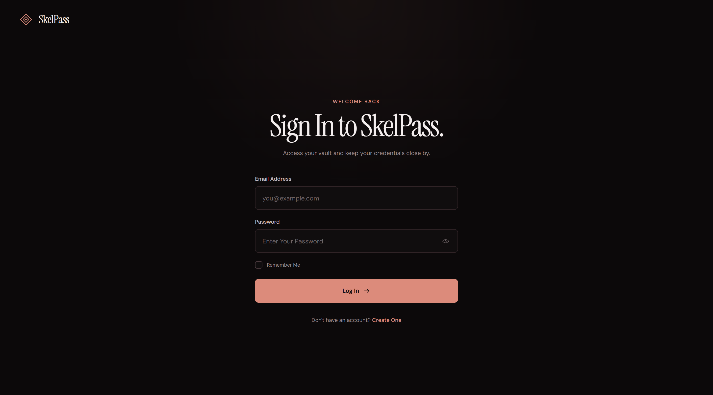

<p align="center">
  
</p>

### SkelPass Desktop 🔒

Official Desktop Client for SkelPass.

#### 📋 Folder Structure

```
skelpass-desktop/
├── main.js                      # App LifeCycle Entry Point
├── package.json                 # Dependencies And Scripts
├── README.md                    # Documentation
├── .gitignore
│
├── src/
│   ├── main/
│   │   ├── window.js           # Window Creation And Config
│   │   ├── ipc.js              # IPC Event Handlers
│   │   └── security.js         # DevTools Blocking And WebView Security
│   │
│   └── preload/
│       └── preload.js          # Context Bridge API
│
├── public/
│   ├── index.html              # Main HTML
│   ├── styles/
│   │   └── titlebar.css        # TitleBar Styles
│   └── scripts/
│       └── main.js             # UI JavaScript
│
└── assets/
    └── icon.png                # Application Icon (2000x2000)
```

#### 🚀 Installation

```bash
# Install Dependencies
npm install

# Start Application
npm run start

# Development Mode (With Debugging)
npm run dev
```

### 🔒 Security Features

✅ **DevTools Blocking**
- F12, Ctrl + Shift + I, Ctrl + U And Similar Shortcuts Blocked
- DevTools Auto-Closes If Opened

✅ **WebView Security**
- Custom User-Agent (Windows Chrome)
- Right-Click Menu Disabled
- Popup Windows Blocked

✅ **Context Isolation**
- Secure API Exposure Via Preload Script
- No Node.js Access From Renderer Process

#### 📝 File Descriptions

#### src/main/
- **window.js** - BrowserWindow Configuration And Creation
- **ipc.js** - IPC Channels (Minimize, Maximize, Close)
- **security.js** - DevTools Blocking And WebView Security

#### src/preload/
- **preload.js** - ElectronAPI Exposure Via Context Bridge

#### public/
- **index.html** - HTML Structure
- **styles/titlebar.css** - TitleBar And UI Styles
- **scripts/main.js** - Loading, Theme, UI Interaction

#### 🔧 Development

##### To Add New Features:

1. Need IPC Handler? → Add To `src/main/ipc.js`
2. Need Preload API? → Add To `src/preload/preload.js`
3. Need Security Rule? → Add To `src/main/security.js`
4. Need UI Changes? → Edit `public/index.html` And `public/scripts/main.js`

#### 📦 Build And Distribution

Use Electron Builder To Create Installers:

```bash
npm install --save-dev electron-builder
```

Add To `package.json`:
```json
{
  "build": {
    "appId": "com.skelvric.skelpass",
    "productName": "SkelPass",
    "directories": {
      "buildResources": "assets"
    },
    "win": {
      "target": ["nsis", "portable"],
      "icon": "assets/icon.png"
    }
  }
}
```

#### 🎨 Application Icon

The Icon Is Located At `/assets/icon.png` And Is Automatically Used By The Application.

To Customize The Icon:
1. Replace `/assets/icon.png` With Your Own PNG File
2. Restart The Application

#### 🐛 Troubleshooting

**Webview Appears Empty?**
- Check Your Internet Connection
- Verify `https://pass.skelvric.com` Is Accessible

**Loading Spinner Doesn't Stop?**
- There's An 8-Second Timeout That Will Force Close The Spinner
- May Be A Network Speed Issue

#### 📄 License

MIT — See [LICENSE](./LICENSE.txt).

#### ❔ Questions?

Open An Issue
